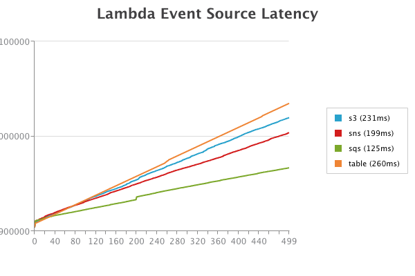

# Lambda Latency

*How long does it take for various Lambda event sources to process an event?  Which is the fastest?  How consistent are they?*

I was idly curious about these questions and couldn't find good data to answer them on the web.  Here's some data and a test harness to recreate the validation.

For each event source, we create an event handler Lambda which just writes a message back to the event source, which in turn should trigger the next event.  Each time, the message in the event is incremented, until a limit (500 in the graph below) is reached at which point the process stops.  This process is serial for each event source.  

Qualitative results:
* SQS is consistently meaningfuly faster than other event sources, with ~130ms of time elapsed between events.
* SNS, S3 and DynamoDB are all suprisingly close, but consistently rank in that order in terms of latency
* Initial startup time sees a Lambda cold-start hit, but after that we do not see anything big enough to be a Lambda cold-start hit, so in-line with expectations it appears Lambda is resusing a single instance of each handler across serial invocations.



## Test Harness

The test harness for this is built with [Pulumi](https://pulumi.com), and creates everything needed for the test in a single 200 line script - including:
1. Provisioning required infrastructure for event sources
1. Hooking up event handlers to infrastructure
1. Describing the code to run in those event handlers
1. Creating shared infrastructure for storing test results, and using it inside the event handlers (via an abstracted test harness)
1. Creating and exposing a REST API for kicking off tests and viewing graphs of test results

Each tests is authored like:

```ts
// Test for Queue
const queue = new aws.sqs.Queue("my-queue", {
    visibilityTimeoutSeconds: 180,
});
function sendQueueValue(val: number) {
    return (new aws.sdk.SQS()).sendMessage({
        QueueUrl: queue.id.get(),
        MessageBody: val.toString(),
    }).promise();
}
const queueSubscription = queue.onEvent("onqueueevent", (ev, ctx) => {
    return harness("sqs", Number(ev.Records[0].body), sendQueueValue);
}, { batchSize: 1});
```

And the shared test infrastructure abstraction is wrapped up in a `harness` function:

```ts
// Test Infrastructure
const table = new aws.dynamodb.Table("stats", {
    attributes: [
        { name: "test", type: "S" },
        { name: "val", type: "N" }
    ],
    hashKey: "test",
    rangeKey: "val",
    readCapacity: 5,
    writeCapacity: 100,
});
const NUM_DATAPOINTS = 100;
async function harness(name: string, val: number, action: (newval: number) => Promise<any>) {
    if(val == NUM_DATAPOINTS) {
        return;
    }
    const start = Date.now();
    const resp = action(val+1);
    const end = Date.now();
    const ddb = new aws.sdk.DynamoDB.DocumentClient();
    const ddbresp = await ddb.put({
        TableName: table.name.get(),
        Item: { test: name, val, start, end },
    }).promise();
    const res = await resp;
    const ddbres = await ddbresp;
}
```

The REST API exposes two routes:
* `/`: Kick off the tests against all event sources
* `/chart`: Get an HTML page with charts like above based on latest test data from all event sources.